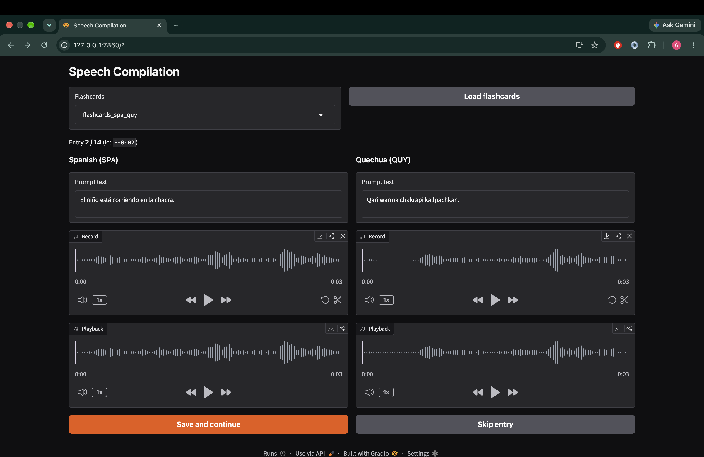

# Speech Compilation

A Gradio app for recording bilingual speech data from flashcard prompts. A
speaker is shown a text prompt in two languages, records audio for each,
can edit the prompt text and replay recordings before saving, and the app
advances through the corpus in order.



## Setup

Requires Python >= 3.12 and [uv](https://docs.astral.sh/uv/).

```bash
uv sync
```

## Input data

Place one or more flashcard CSVs in `data/`, named `flashcards_*.csv`.
Each file is semicolon-delimited with a header row `ID;LANG1;LANG2`, e.g.:

```
ID;SPA;QUY
F-0001;El niño va corriendo a la chacra.;Qari warma chakraman kallpaspa rin.
```

The app lists every `data/flashcards_*.csv` file in a dropdown; the two
language columns in the header determine the prompt labels.

## Running

```bash
uv run python main.py
```

Then open the local URL Gradio prints (default `http://127.0.0.1:7860`).

1. Pick a flashcards file from the dropdown and click **Load flashcards**.
2. Edit the prompt text if needed, then record audio for each language.
3. Use the **Playback** panel to verify each recording before saving.
4. Click **Save and continue** to write the entry and advance to the next
   one, or **Skip entry** to move on without saving.

## Output

For each input file `data/flashcards_<name>.csv`, output is written to
`output/flashcards_<name>/`:

- `audio/<ID>_<LANG>.wav` — one recording per language per entry
- `flashcards.csv` — the saved text (edited or not) and audio file paths,
  appended in the same order as the source corpus

Progress is resumable: relaunching the app skips any entry whose ID is
already present in the output `flashcards.csv`.
